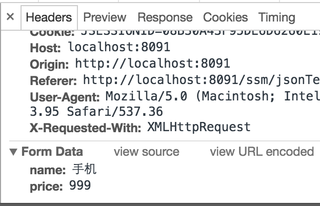
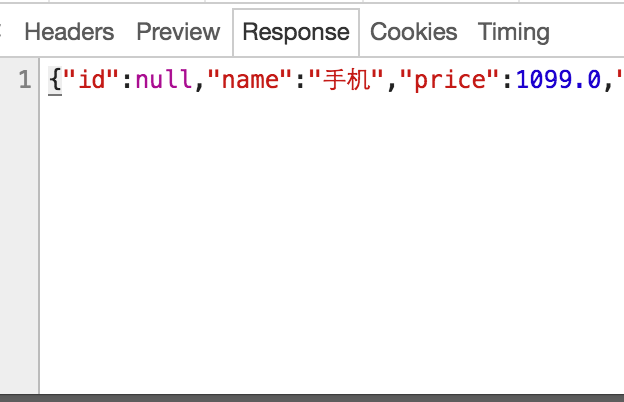

# springMVC处理JSON请求

1. 添加jar包依赖

```xml
<dependency>
    <groupId>com.fasterxml.jackson.core</groupId>
    <artifactId>jackson-databind</artifactId>
    <version>2.4.1</version>
</dependency>
<dependency>
    <groupId>org.codehaus.jackson</groupId>
    <artifactId>jackson-mapper-asl</artifactId>
    <version>1.9.13</version>
</dependency>
```


2. Controller

```java
/**
 *请求是json格式，返回也是json格式
 */
@RequestMapping("/requestJson")
    public @ResponseBody ItemsCustom requestJsonTest(@RequestBody ItemsCustom itemsCustom, HttpServletRequest request) throws Exception {

        HttpSession session = request.getSession();
        //@ResponseBody将itemsCustom转成json输出
        return itemsCustom;
    }
/**
 *请求不是json格式，返回也是json格式
 */
@RequestMapping("/responseJson")
public @ResponseBody ItemsCustom responseJson(ItemsCustom itemsCustom){

    //@ResponseBody将itemsCustom转成json输出
    if (itemsCustom != null && itemsCustom.getPrice() != null) {
        itemsCustom.setPrice(itemsCustom.getPrice() +100);
    }
    return itemsCustom;
}
```


3. 前台jsp 

```jsp
//请求json，输出是json
        function requestJson(){
            $.ajax({
                type:'post',
                url:'requestJson.action',
                contentType:'application/json;charset=utf-8',
                //数据格式是json串，商品信息
                data:'{"name":"手机","price":999}',
                success:function(data){//返回json结果
                    console.log(data)
                }
            });
        }
        //请求key/value，输出是json
        function responseJson(){
            $.ajax({
                type:'post',
                url:'${pageContext.request.contextPath }/responseJson.action',
                contentType:'application/x-www-form-urlencoded;charset=utf-8',
                //数据格式是json串，商品信息
                data:'name=手机&price=999',
                success:function(data){//返回json结果
                    console.log(data)
                }
            });
        }
```

4. 测试截图







